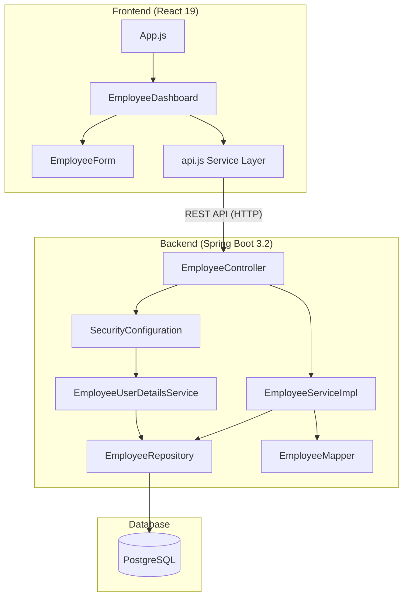

# 📋 QE SE Catalyst — Employee Management System

## Brief Description

**QE SE Catalyst** is a **full-stack Employee Management System (EMS)** built as part of the *SE Core Competency for QE* project. It provides a web-based dashboard where users can **create, view, edit, search, and delete employee records**, all secured behind an **authentication layer**. The application follows an agentic, AI-assisted development workflow using GitHub Copilot.

| Layer | Technology |
|---|---|
| **Frontend** | React 19, JavaScript, React Toastify |
| **Backend** | Java 21, Spring Boot 3.2.4, Spring Data JPA, Spring Security |
| **Database** | PostgreSQL (production) / H2 (testing) |
| **Build Tools** | Maven (backend), npm/react-scripts (frontend) |
| **Other** | Lombok, Jackson, JaCoCo (code coverage), Mockito (testing) |

---

## 🔐 Feature 1: User Authentication (Login)

### What it does
Provides a **login endpoint** (`POST /api/employees/login`) that authenticates users by email and password. Spring Security protects all other API endpoints — only the login route is publicly accessible.

### How it works
- The [LoginRequest](file:///Users/krinainamdar/Documents/qe-se-catalyst/backend/src/main/java/com/example/ems/dto/LoginRequest.java) DTO accepts `email` and `password`.
- The [EmployeeController](file:///Users/krinainamdar/Documents/qe-se-catalyst/backend/src/main/java/com/example/ems/controller/EmployeeController.java#L37-L50) uses Spring's `AuthenticationManager` to validate credentials.
- [SecurityConfiguration](file:///Users/krinainamdar/Documents/qe-se-catalyst/backend/src/main/java/com/example/ems/config/SecurityConfiguration.java) defines the security filter chain:
  - `/api/employees/login` → **permitAll** (public)
  - All other requests → **authenticated** (protected)
- [EmployeeUserDetailsService](file:///Users/krinainamdar/Documents/qe-se-catalyst/backend/src/main/java/com/example/ems/service/EmployeeUserDetailsService.java) implements [UserDetailsService](file:///Users/krinainamdar/Documents/qe-se-catalyst/backend/src/main/java/com/example/ems/service/EmployeeUserDetailsService.java#10-31), looking up employees by email from the database for authentication.
- Passwords are **hashed** using a `PasswordEncoder` (BCrypt) — configured in [EncoderConfig](file:///Users/krinainamdar/Documents/qe-se-catalyst/backend/src/main/java/com/example/ems/config/EncoderConfig.java).

### Key detail
> The system supports **dual authentication**: an in-memory user (`user` / `password`) configured in [SecurityConfiguration](file:///Users/krinainamdar/Documents/qe-se-catalyst/backend/src/main/java/com/example/ems/config/SecurityConfiguration.java#14-45), and database-backed employee logins via [EmployeeUserDetailsService](file:///Users/krinainamdar/Documents/qe-se-catalyst/backend/src/main/java/com/example/ems/service/EmployeeUserDetailsService.java#10-31).

---

## ➕ Feature 2: Create Employee

### What it does
Allows adding a new employee to the system with fields: **First Name, Last Name, Email, Phone, Role, and Password**.

### How it works
- **Frontend**: The [EmployeeForm](file:///Users/krinainamdar/Documents/qe-se-catalyst/employee-frontend/src/components/EmployeeForm.js) component renders a modal dialog with input fields. It validates that first name, last name, and email are required before submission.
- **API Call**: The [createEmployee()](file:///Users/krinainamdar/Documents/qe-se-catalyst/employee-frontend/src/services/api.js#L22-L29) function sends a `POST` request to `/api/employees` with the employee payload as JSON.
- **Backend**: The [EmployeeController](file:///Users/krinainamdar/Documents/qe-se-catalyst/backend/src/main/java/com/example/ems/controller/EmployeeController.java#L52-L56) receives the DTO, delegates to [EmployeeServiceImpl.createEmployee()](file:///Users/krinainamdar/Documents/qe-se-catalyst/backend/src/main/java/com/example/ems/service/impl/EmployeeServiceImpl.java#L27-L37):
  1. Maps the DTO → Entity using [EmployeeMapper](file:///Users/krinainamdar/Documents/qe-se-catalyst/backend/src/main/java/com/example/ems/mapper/EmployeeMapper.java)
  2. **Encrypts the password** with BCrypt before saving
  3. Saves to PostgreSQL via [EmployeeRepository](file:///Users/krinainamdar/Documents/qe-se-catalyst/backend/src/main/java/com/example/ems/repository/EmployeeRepository.java)
  4. Returns the saved entity as a DTO (with password set to `null` for security)
- **Feedback**: A **toast notification** ("Employee created!") confirms success.

---

## 📋 Feature 3: View All Employees (Dashboard)

### What it does
Displays all employee records in a **data table** on the main dashboard, with columns for ID, First Name, Last Name, Email, Phone, and Role.

### How it works
- **Frontend**: The [EmployeeDashboard](file:///Users/krinainamdar/Documents/qe-se-catalyst/employee-frontend/src/components/EmployeeDashboard.js) component fetches employees on mount using `useEffect` and stores them in `useState`.
- **API Call**: The [getEmployees()](file:///Users/krinainamdar/Documents/qe-se-catalyst/employee-frontend/src/services/api.js#L12-L15) function sends a `GET` request to `/api/employees`.
- **Backend**: [EmployeeController.getAllEmployees()](file:///Users/krinainamdar/Documents/qe-se-catalyst/backend/src/main/java/com/example/ems/controller/EmployeeController.java#L64-L68) → [EmployeeServiceImpl.getAllEmployees()](file:///Users/krinainamdar/Documents/qe-se-catalyst/backend/src/main/java/com/example/ems/service/impl/EmployeeServiceImpl.java#L61-L66) fetches all records from the database, maps each entity to a DTO (stripping passwords), and returns the list.
- **Loading state**: A "Loading..." message is shown while the API call is in progress.
- **Empty state**: "No employees" is displayed when the table has no records.

---

## ✏️ Feature 4: Edit Employee

### What it does
Allows updating an existing employee's details (first name, last name, email, phone, role) through the same modal form used for creation.

### How it works
- Clicking the **✏️ (edit) button** on a table row populates the [EmployeeForm](file:///Users/krinainamdar/Documents/qe-se-catalyst/employee-frontend/src/components/EmployeeForm.js) modal with the employee's current data via the `initial` prop.
- The form title changes to **"Edit Employee"** and the submit button reads **"Save"** (instead of "Create").
- **API Call**: The [updateEmployee(id, payload)](file:///Users/krinainamdar/Documents/qe-se-catalyst/employee-frontend/src/services/api.js#L31-L38) function sends a `PUT` request to `/api/employees/{id}`.
- **Backend**: [EmployeeServiceImpl.updateEmployee()](file:///Users/krinainamdar/Documents/qe-se-catalyst/backend/src/main/java/com/example/ems/service/impl/EmployeeServiceImpl.java#L40-L52):
  1. Finds the existing employee (or throws [ResourceNotFoundException](file:///Users/krinainamdar/Documents/qe-se-catalyst/backend/src/main/java/com/example/ems/exception/ResourceNotFoundException.java#6-13))
  2. Uses `EmployeeMapper.updateEmployeeFromDto()` to patch the fields
  3. Only re-encodes the password if a new password is provided
  4. Saves and returns the updated DTO
- **Feedback**: A toast notification ("Employee updated successfully!") confirms the update.

---

## ❌ Feature 5: Delete Employee

### What it does
Permanently deletes an employee record from the system.

### How it works
- Clicking the **❌ (delete) button** triggers a **browser confirmation dialog** (`window.confirm`) to prevent accidental deletion.
- If confirmed, the [deleteEmployee(id)](file:///Users/krinainamdar/Documents/qe-se-catalyst/employee-frontend/src/services/api.js#L40-L43) function sends a `DELETE` request to `/api/employees/{id}`.
- **Backend**: [EmployeeServiceImpl.deleteEmployee()](file:///Users/krinainamdar/Documents/qe-se-catalyst/backend/src/main/java/com/example/ems/service/impl/EmployeeServiceImpl.java#L68-L73):
  1. Finds the employee or throws [ResourceNotFoundException](file:///Users/krinainamdar/Documents/qe-se-catalyst/backend/src/main/java/com/example/ems/exception/ResourceNotFoundException.java#6-13)
  2. Deletes the entity from the database
  3. Returns `204 No Content`
- **Frontend**: The employee is removed from the local state array (`filter`) for an **instant UI update** without re-fetching.
- **Feedback**: A toast ("Employee deleted") confirms deletion.

---

## 🔍 Feature 6: Search / Filter Employees

### What it does
Provides a **real-time, client-side search bar** to filter the employee table by name or email.

### How it works
- A search `<input>` in the [EmployeeDashboard](file:///Users/krinainamdar/Documents/qe-se-catalyst/employee-frontend/src/components/EmployeeDashboard.js#L102-L109) toolbar captures user input in the `search` state.
- The `filteredEmployees` array is computed by filtering the full `employees` array:
  ```js
  employees.filter((e) =>
    `${e.firstName} ${e.lastName} ${e.email}`
      .toLowerCase()
      .includes(search.toLowerCase())
  )
  ```
- The search is **case-insensitive** and matches across first name, last name, and email simultaneously.
- Results update **instantly** as the user types (no network calls).

---

## 📄 Feature 7: Client-Side Pagination

### What it does
Paginates the (filtered) employee list, showing **5 employees per page** with numbered page buttons.

### How it works
- Defined in [EmployeeDashboard](file:///Users/krinainamdar/Documents/qe-se-catalyst/employee-frontend/src/components/EmployeeDashboard.js#L17-L33):
  - `employeesPerPage = 5` — configurable page size
  - `currentEmployees` is derived by slicing the `filteredEmployees` array based on the current page
  - `totalPages` is computed dynamically: `Math.ceil(filteredEmployees.length / employeesPerPage)`
- Pagination buttons are generated dynamically and highlight the **active page** with the `.active` CSS class.
- Pagination respects the search filter — if you search, only matching results are paginated.

---

## 🔄 Feature 8: CORS Configuration

### What it does
Enables the React frontend (running on `localhost:3000` or `localhost:5173`) to communicate with the Spring Boot backend (running on `localhost:8081`).

### How it works
- **Controller-level**: The `@CrossOrigin` annotation on [EmployeeController](file:///Users/krinainamdar/Documents/qe-se-catalyst/backend/src/main/java/com/example/ems/controller/EmployeeController.java#L29) allows requests from `http://localhost:3000` and `http://localhost:5173`.
- **Global-level**: The [WebConfig](file:///Users/krinainamdar/Documents/qe-se-catalyst/backend/src/main/java/com/example/ems/config/WebConfig.java) class implements `WebMvcConfigurer` and registers CORS mappings for all `/api/**` routes, allowing `GET`, `POST`, `PUT`, `DELETE`, and `OPTIONS` methods.

---

## 🛡️ Feature 9: Password Encryption

### What it does
All employee passwords are **hashed with BCrypt** before being stored in PostgreSQL — raw passwords are never persisted.

### How it works
- A `PasswordEncoder` bean (BCrypt) is defined in [EncoderConfig](file:///Users/krinainamdar/Documents/qe-se-catalyst/backend/src/main/java/com/example/ems/config/EncoderConfig.java).
- On **create**: `passwordEncoder.encode(password)` is called before `save()` in [EmployeeServiceImpl](file:///Users/krinainamdar/Documents/qe-se-catalyst/backend/src/main/java/com/example/ems/service/impl/EmployeeServiceImpl.java#L30-L33).
- On **update**: Password is only re-encoded if a non-empty new password is provided.
- The [EmployeeMapper.mapToEmployeeDto()](file:///Users/krinainamdar/Documents/qe-se-catalyst/backend/src/main/java/com/example/ems/mapper/EmployeeMapper.java#L8-L18) method sets the password field to `null` in the DTO, ensuring **passwords are never returned to the frontend**.

---

## ⚠️ Feature 10: Error Handling & User Feedback

### What it does
Provides structured error handling on both backend and frontend with visual toast notifications.

### How it works
- **Backend**: A custom [ResourceNotFoundException](file:///Users/krinainamdar/Documents/qe-se-catalyst/backend/src/main/java/com/example/ems/exception/ResourceNotFoundException.java) is annotated with `@ResponseStatus(HttpStatus.NOT_FOUND)` and thrown when an employee ID is not found during get/update/delete operations.
- **Frontend API layer**: The [handleResponse()](file:///Users/krinainamdar/Documents/qe-se-catalyst/employee-frontend/src/services/api.js#L4-L10) utility checks `res.ok` and throws a descriptive error with the HTTP status, status text, and response body on failure.
- **Frontend UI**: [react-toastify](https://www.npmjs.com/package/react-toastify) is used for toast notifications:
  - 🟢 **Success**: "Employee created!", "Employee deleted"
  - 🔵 **Info**: "Employee updated successfully!"
  - 🔴 **Error**: "Delete failed: ..." (and inline form errors for validation)
- **Form validation**: The [EmployeeForm](file:///Users/krinainamdar/Documents/qe-se-catalyst/employee-frontend/src/components/EmployeeForm.js#L35-L38) validates that first name, last name, and email are required before allowing submission.

---

## 🧪 Feature 11: Comprehensive Testing

### What it does
Both backend and frontend include **unit and integration tests** for quality assurance.

### Backend Tests (8 test files)
| Test File | Coverage Area |
|---|---|
| `EmployeeManagementBackendApplicationTest` | Application context loads |
| `SecurityConfigurationTest` | Security filter chain rules |
| `EmployeeControllerTest` | REST API endpoint behavior (MockMvc) |
| `EmployeeDtoTest` | DTO getters/setters |
| `EmployeeTest` | Entity getters/setters |
| `ResourceNotFoundExceptionTest` | Custom exception behavior |
| `EmployeeRepositoryTest` | JPA repository operations |
| `EmployeeServiceImplTest` | Business logic / service layer |

- Uses **H2 in-memory database** for test isolation
- **JaCoCo** plugin generates code coverage reports
- **Mockito** is used for mocking dependencies

### Frontend Tests
| Test File | Coverage Area |
|---|---|
| [App.test.js](file:///Users/krinainamdar/Documents/qe-se-catalyst/employee-frontend/src/App.test.js) | App component renders |
| [EmployeeList.test.js](file:///Users/krinainamdar/Documents/qe-se-catalyst/employee-frontend/src/test/EmployeeList.test.js) | Employee listing behavior |

- Uses **React Testing Library** + **Jest**

---

## 🏗️ Architecture Summary



> [!NOTE]
> The frontend runs on **port 3000** (React dev server) and proxies API requests to the backend on **port 8081** (Spring Boot). The backend connects to a local **PostgreSQL** database named `employee_db`.
